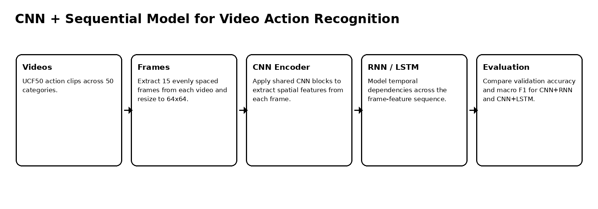
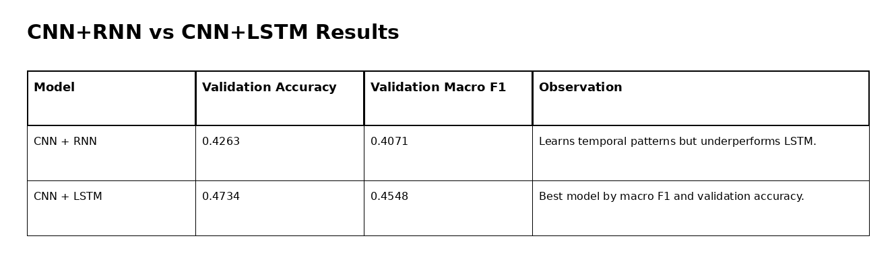
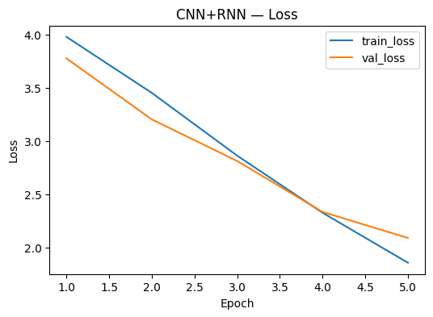
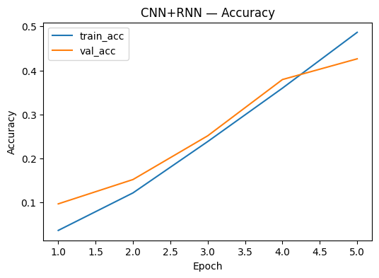
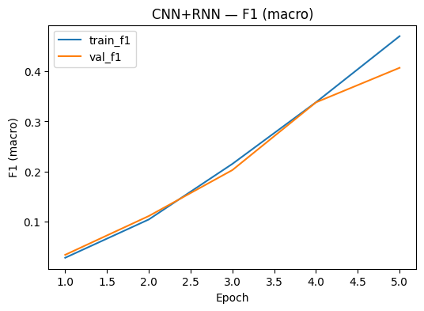
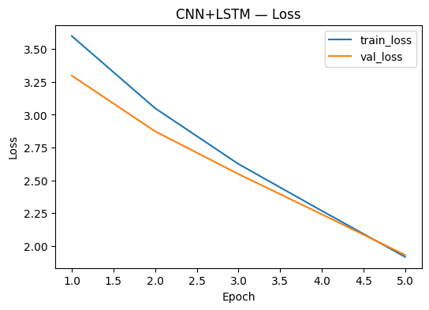
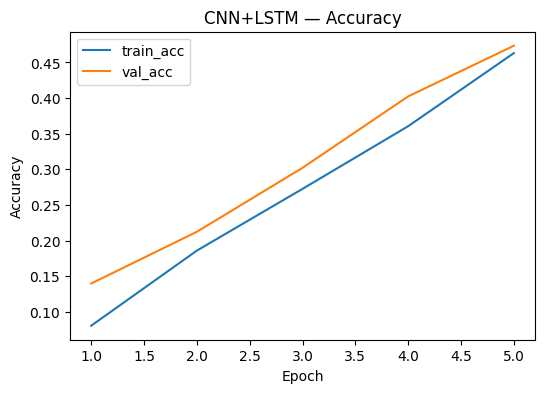
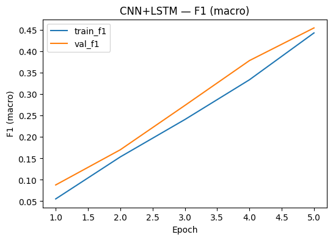

# UCF50 CNN-LSTM Action Recognition

Video classification workflow that combines CNN spatial feature extraction with RNN and LSTM temporal modeling on UCF50 action recognition clips.

## Overview

This project studies action recognition from video. It uses a CNN to encode spatial information from video frames and compares two sequence models, RNN and LSTM, for temporal modeling.

The project is important because video classification is not just image classification repeated over frames. It requires learning how visual features evolve over time.

## Dataset

| Item | Details |
|---|---|
| Dataset | UCF50 Action Recognition |
| Source | Kaggle realistic action recognition UCF50 dataset |
| Videos | 6,681 |
| Classes | 50 action categories |
| Frame sampling | 15 evenly spaced frames per video |
| Frame size | 64 × 64 |
| Pixel normalization | [0, 1] |

## Modeling Pipeline



A three-block CNN extracts frame-level spatial features. The extracted sequence is then passed into either an RNN or LSTM classifier to make the final video-level prediction.

## Model Comparison



| Model | Train accuracy | Validation accuracy | Train macro F1 | Validation macro F1 |
|---|---:|---:|---:|---:|
| CNN + RNN | 0.4865 | 0.4263 | 0.4703 | 0.4071 |
| CNN + LSTM | 0.4631 | 0.4734 | 0.4432 | 0.4548 |

## Interpretation

The CNN+LSTM model performed better by validation accuracy and macro F1. This is expected because LSTMs are better suited for longer temporal dependencies and can manage information flow with gates, while a plain RNN is more limited.

Both models improved steadily over five epochs. The results also show that 50-class video recognition is difficult when using relatively small resized frames and short training time, making the comparison more useful than the raw accuracy alone.

## Visual Summary

| CNN+RNN loss | CNN+RNN accuracy | CNN+RNN macro F1 |
|---|---|---|
|  |  |  |

| CNN+LSTM loss | CNN+LSTM accuracy | CNN+LSTM macro F1 |
|---|---|---|
|  |  |  |

## Repository Contents

```text
.
├── ucf50_cnn_lstm_action_recognition.ipynb
├── docs/
│   └── figures/
├── requirements.txt
├── .gitignore
└── README.md
```

## Run Locally

This repository is notebook-based. Create a clean Python environment, install the dependencies, then open the notebook.

### Windows PowerShell

```powershell
py -3.10 -m venv .venv
.\.venv\Scripts\Activate.ps1
python -m pip install --upgrade pip
pip install -r requirements.txt
```

### Linux / macOS

```bash
python3 -m venv .venv
source .venv/bin/activate
python -m pip install --upgrade pip
pip install -r requirements.txt
```


## Open the Notebook

```bash
jupyter notebook ucf50_cnn_lstm_action_recognition.ipynb
```

## Notes

The UCF50 dataset is large and is not included in this repository. Running the notebook is best done on a GPU runtime.
